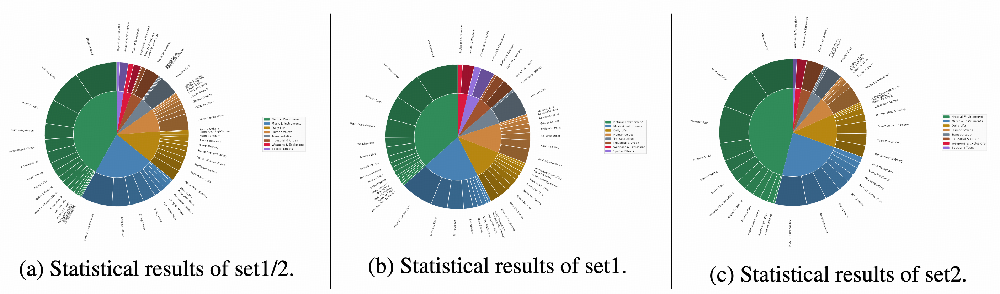

# Verse-Bench

<p align="center">
          🤗 <a href="https://huggingface.co/dorni/UniVerse-1-Base/">UniVerse-1 Models</a>&nbsp&nbsp | &nbsp&nbsp🤗 <a href="https://huggingface.co/datasets/dorni/Verse-Bench/">Verse-Bench</a></a>&nbsp&nbsp | &nbsp&nbsp 📑 <a href="https://arxiv.org/pdf/2509.06155">Tech Report</a> &nbsp&nbsp | &nbsp&nbsp 📑 <a href="https://dorniwang.github.io/UniVerse-1/">Project Page</a> &nbsp&nbsp 💻 <a href="https://github.com/Dorniwang/UniVerse-1-code/">Code</a> &nbsp&nbsp
<br>
</p>
<p align="center">
    
<p>

Verse-Bench is a benchmark we developed for evaluating joint audio-visual generation. We curated 600 image-text prompt pairs from a
multitude of sources. These sources encompass frames extracted from YouTube videos, BiliBili videos, TikTok clips, movies, and anime; images generated by AI models; and a collection of images from public websites. Our dataset comprises three subsets：
- **Set1-I** contains image-text pairs (including AI-generated, web-crawled, and media screenshots), for which video/audio captions and speech content were produced using LLMs and manual annotation, comprising a total of 205 samples. Statistical results in figure (b).
- **Set2-V** consists of video clips from YouTube and Bilibili, which were annotated with LLM-generate captions and Whisper-based ASR transcripts, followed by human verification,
comprising a total of 295 samples. Statistical results in figure (c).
- **Set3-Ted** includes TED Talks from September 2025, processed with the same annotation pipeline as Set2, comprising a total of 100 samples.

## Download
- **Set1**: You can download from this repository directly. The image and prompt pairs share the same file name.
- **Set2** & **Set3**: 
    ```
    cd set2(set3)
    download: python download.py
    process:  python process.py
    ```
    Then you will get directory named *videos_raw* and *clips*, videos in *videos_raw* are raw video download from youtube or bilibili, and data in *clips* are processed results, inculdes: 
    - ***xxx.mp4***: processed clip videos.
    - ***xxx.wav***: corresponding audio of the clip video.
    - ***xxx.png***: reference image of the clip video.

    The prompts of video, audio, and content speech is in *data/*, share the same file name with clip videos in *clips/*.

## License

The code in the repository is licensed under [Apache 2.0](LICENSE) License.

## Citation
If you find Verse-Bench is useful to your research, please cite our work, thank you!

```
@article{wang2025universe,
  title={UniVerse-1: Unified Audio-Video Generation via Stitching of Experts},
  author={Wang, Duomin and Zuo, Wei and Li, Aojie and Chen, Ling-Hao and Liao, Xinyao and Zhou, Deyu and Yin, Zixin and Dai, Xili and Jiang, Daxin and Yu, Gang},
  journal={arXiv preprint arXiv:2509.06155},
  year={2025}
}
```
